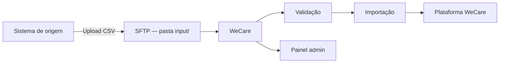

# Integração de Colaboradores via SFTP

Este guia é voltado à **equipe de TI** responsável por configurar o envio de arquivos de colaboradores para a WeCare.

Qualquer sistema de origem (RH, folha de pagamento, ERP ou processo manual) pode gerar o arquivo e disponibilizá-lo no servidor SFTP. A WeCare realiza a **criação e atualização** dos colaboradores na plataforma, incluindo:

- Dados de perfil (nome, e-mail, matrícula, cargo, datas)
- Estrutura de áreas (até 3 níveis)
- Liderança direta (gestor)
- Bloqueio de acesso
- Desligamento (imediato ou agendado)

---

## Visão geral do fluxo



**Resumo:**

1. O sistema de origem exporta um arquivo CSV e o envia para o servidor SFTP.
2. A WeCare conecta no SFTP, baixa os arquivos `.csv` da pasta `input/`, valida linha a linha e importa os dados.
3. O resultado fica disponível no **painel admin** da empresa, em **Importações SFTP**, com erros, avisos e estatísticas.

:::info Periodicidade recomendada
Envie o arquivo **diariamente**, preferencialmente entre **00:00 e 06:00** (horário de Brasília), para que a sincronização automática processe os dados antes do início do expediente.
:::

---

## 1. Configuração do SFTP

### 1.1 Credenciais e acesso

A WeCare configura a integração no ambiente da empresa. O time de TI deve fornecer (ou receber, conforme o modelo acordado):

| Parâmetro | Descrição |
|-----------|-----------|
| **Host** | Endereço do servidor SFTP |
| **Porta** | Geralmente `22` |
| **Usuário** | Conta com permissão de leitura na pasta de entrada |
| **Senha** | Credencial da conta SFTP |

A WeCare **conecta no SFTP da empresa** e **baixa** os arquivos — não é necessário que a empresa acesse a infraestrutura WeCare.

### 1.2 Diretório de envio

| Item | Valor |
|------|-------|
| **Pasta de leitura** | `input/` (relativa à raiz do usuário SFTP) |
| **Formato aceito** | Apenas arquivos **`.csv`** |
| **Quantidade** | Todos os `.csv` presentes na pasta são processados em cada sincronização |

:::warning Importante
Certifique-se de que o usuário SFTP tenha permissão de **leitura** na pasta `input/` e que os arquivos estejam disponíveis antes da janela de sincronização.
:::

### 1.3 Nome do arquivo

O **nome do arquivo não é relevante** para o processamento. Qualquer arquivo com extensão `.csv` na pasta `input/` será importado.

Recomenda-se apenas que o nome permita identificar a data ou a origem do envio (ex.: `colaboradores_20260608.csv`), para facilitar o suporte e a auditoria.

#### Upload atômico (recomendado)

Para evitar que a WeCare leia um arquivo ainda em gravação:

1. Envie o arquivo com extensão temporária (ex.: `colaboradores.csv.part`)
2. Após concluir o upload, **renomeie** para `.csv` (ex.: `colaboradores.csv`)

### 1.4 Segurança

- Utilize SFTP (SSH), não FTP simples.
- Restrinja o usuário SFTP à pasta de entrada (chroot ou equivalente).
- Rotacione senhas periodicamente e comunique a WeCare quando houver alteração.

---

## 2. Formato do arquivo

### 2.1 Estrutura geral

| Regra | Detalhe |
|-------|---------|
| **Extensão** | `.csv` |
| **Cabeçalho** | Obrigatório na **linha 1** |
| **Codificação** | UTF-8 (com ou sem BOM). Também aceito: Windows-1252 e ISO-8859-1 |
| **Separador** | Vírgula (`,`) ou ponto e vírgula (`;`) |
| **Datas** | `YYYY-MM-DD` (recomendado) ou `DD/MM/YYYY` |

:::tip Excel no Brasil
Exportações do Excel em português costumam usar **`;`** como separador e **Windows-1252** como codificação. Ambos são aceitos.
:::

### 2.2 Cabeçalho — variações aceitas

O sistema reconhece variações comuns nos nomes das colunas:

| Na planilha | Equivalente aceito |
|-------------|-------------------|
| `E-mail` ou `Email` | Mesmo campo |
| `Matricula Lideranca Direta` | Coluna de matrícula do gestor (com espaços) |
| Demais colunas | Conforme dicionário abaixo |

---

## 3. Dicionário de dados

### 3.1 Colunas

| Coluna | Obrigatório | Tipo | Tamanho máx. | Regras | Observações |
|--------|-------------|------|--------------|--------|-------------|
| **E-mail** / **Email** | Condicional | texto | 254 | Formato de e-mail válido | Obrigatório se **Matricula** estiver vazia. Único por colaborador na empresa. |
| **Matricula** | Condicional | texto | 50 | Alfanumérico; sem espaços nas extremidades | Obrigatório se **E-mail** estiver vazio. Único por colaborador na empresa. |
| **Nome** | **Sim** | texto | 150 | Texto livre | Atualiza o nome exibido na plataforma. |
| **Matricula Lideranca Direta** | Não | texto | 50 | Matrícula do gestor | Tem **prioridade** sobre `LiderancaDireta` quando preenchida. |
| **LiderancaDireta** | Não | texto | 254 | E-mail, matrícula ou nome completo do gestor | Usado quando a coluna de matrícula do líder está vazia. |
| **AreaNivel1** | Não | texto | 100 | Texto livre | Área de nível 1; criada automaticamente se não existir. |
| **AreaNivel2** | Não | texto | 100 | Texto livre | Depende de AreaNivel1. |
| **AreaNivel3** | Não | texto | 100 | Texto livre | Depende de AreaNivel2. |
| **Cargo** | Não | texto | 100 | Texto livre | Atualiza o cargo/função do colaborador. |
| **DataNascimento** | Não | data | — | `YYYY-MM-DD` ou `DD/MM/YYYY` | |
| **DataAdmissao** | Não | data | — | `YYYY-MM-DD` ou `DD/MM/YYYY` | |
| **DataBloqueio** | Não | data | — | `YYYY-MM-DD` ou `DD/MM/YYYY` | Ver seção [Bloqueio](#52-bloqueio). Campo **pode ser limpo** (vazio remove bloqueio). |
| **DataDesligamento** | Não | data | — | `YYYY-MM-DD` ou `DD/MM/YYYY` | Ver seção [Desligamento](#53-desligamento). Campo **pode ser limpo** (vazio cancela desligamento agendado). |

### 3.2 Identificação do colaborador

A chave de identificação segue esta ordem:

1. **E-mail** (preferencial), se presente na linha
2. **Matrícula**, se o e-mail estiver ausente
3. Se **ambos** estiverem presentes, devem apontar para a **mesma pessoa** na WeCare — caso contrário, a linha é **rejeitada**

:::info Pelo menos um identificador
Cada linha deve ter **E-mail ou Matricula** (ou ambos). Linhas sem nenhum dos dois são rejeitadas.
:::

### 3.3 Liderança direta

Ordem de resolução do gestor:

1. **`Matricula Lideranca Direta`** — busca o gestor pela matrícula
2. **`LiderancaDireta`**, se a coluna acima estiver vazia:
   - Se contiver `@` e for e-mail válido → busca por e-mail
   - Senão → busca por matrícula
   - Se não encontrar → busca por **nome completo** (comparação exata, sem diferenciar maiúsculas/minúsculas)

Se o gestor **não for encontrado** ou estiver **bloqueado/desligado**:

- A linha **não é rejeitada** (é um aviso, não um erro)
- O vínculo de liderança **anterior é mantido**
- O aviso aparece no relatório da importação

---

## 4. Regras de validação

Antes da importação, cada linha passa por validação. Linhas com **erro** são **ignoradas** na importação; linhas com apenas **avisos** são importadas normalmente.

### 4.1 Erros bloqueantes (linha ignorada)

| Situação | Mensagem típica |
|----------|-----------------|
| E-mail e Matricula ausentes | Informe Email ou Matricula |
| E-mail e Matricula apontam para pessoas diferentes | Conflito Email x Matricula |
| E-mail inválido | Email inválido |
| E-mail duplicado no mesmo arquivo | Email duplicado na planilha |
| Matricula duplicada no mesmo arquivo | Matricula duplicada na planilha |
| Nome vazio | Nome é obrigatório |
| Nome com mais de 150 caracteres | Nome deve ter no máximo 150 caracteres |
| Data em formato inválido | Data em formato não reconhecido |
| Colunas obrigatórias ausentes no cabeçalho | Colunas obrigatórias ausentes |

**Colunas obrigatórias no cabeçalho** (podem estar vazias na linha, exceto identificação e nome):

`Email`, `Matricula`, `Nome`, `AreaNivel1`, `AreaNivel2`, `AreaNivel3`, `Cargo`, `DataNascimento`, `DataAdmissao`, `DataBloqueio`, `DataDesligamento`

### 4.2 Avisos (linha importada)

| Situação | Comportamento |
|----------|---------------|
| Líder não encontrado | Importação segue; vínculo anterior mantido |
| E-mail de líder inválido em `LiderancaDireta` | Tenta matrícula ou nome; registra aviso |

---

## 5. Regras de atualização e eventos

### 5.1 Criação e atualização

| Regra | Comportamento |
|-------|---------------|
| **Identificação** | Por e-mail (se presente) ou por matrícula |
| **Criação** | Se não existir colaborador com o e-mail/matrícula informados |
| **Atualização** | Se já existir colaborador correspondente |
| **Campos vazios** | **Não apagam** dados existentes (exceto `DataBloqueio` e `DataDesligamento`) |
| **Campos preenchidos** | Sobrescrevem o valor atual na WeCare |

:::tip Base já existente
Se a empresa já possui colaboradores cadastrados na WeCare, a importação **atualiza** os registros existentes desde que o **e-mail ou a matrícula** na planilha correspondam aos dados já cadastrados.
:::

### 5.2 Bloqueio

Comportamento da coluna `DataBloqueio`:

| Valor na planilha | Efeito |
|-------------------|--------|
| **Vazio** | Remove bloqueio ativo ou cancela bloqueio agendado |
| **Data ≤ hoje** | Bloqueia o colaborador **imediatamente** |
| **Data futura** | **Agenda** o bloqueio para a data informada |

Colaborador bloqueado **não consegue fazer login**, mas **não é desligado** da plataforma.

### 5.3 Desligamento

A data informada em `DataDesligamento` é a **data de referência do desligamento**. A WeCare pode aplicar um **período de carência** adicional, configurado por empresa em acordo com o suporte.

| Valor na planilha | Efeito |
|-------------------|--------|
| **Vazio** | Cancela desligamento agendado pela integração |
| **Data já passada ou hoje** | Desliga o colaborador na **próxima sincronização** |
| **Data futura** | **Agenda** o desligamento para a data efetiva |

:::info Carência de desligamento
Confirme com o suporte WeCare se há dias de carência após a data da planilha. Com carência zero, a data informada no arquivo é a data efetiva de desligamento.
:::

:::info Desligamentos agendados
Desligamentos com data futura são efetivados automaticamente pela WeCare na data prevista, sem necessidade de novo envio do arquivo.
:::

**Prioridade bloqueio x desligamento:** se houver `DataBloqueio` e `DataDesligamento`, o colaborador pode permanecer bloqueado até a data efetiva do desligamento; quando o desligamento é efetivado, o colaborador é removido da plataforma.

### 5.4 Campos que aceitam “limpeza”

Apenas estes campos interpretam valor **vazio** como comando de remoção/cancelamento:

- `DataBloqueio` → remove bloqueio
- `DataDesligamento` → cancela desligamento agendado

Todos os demais campos: **vazio = não altera** o valor existente.

---

## 6. Sincronização automática

A WeCare executa a sincronização **diariamente**, em horário configurado pela equipe de operações. O dia da execução pode ser ajustado por empresa (ex.: todos os dias ou em dias específicos do mês).

### Janela operacional sugerida

| Horário (Brasília) | Ação da empresa |
|--------------------|-----------------|
| 00:00 – 05:00 | Enviar/atualizar o CSV no SFTP (`input/`) |
| Manhã (após o envio) | WeCare processa automaticamente |

Desligamentos e bloqueios com data futura são efetivados automaticamente na data prevista.

---

## 7. Relatórios e acompanhamento

### Painel admin WeCare

Usuários com permissão de **Pessoas e estrutura** acessam:

**Admin → Pessoas e estrutura → Importações SFTP**

Para cada arquivo processado, o painel exibe:

| Informação | Descrição |
|------------|-----------|
| Data de recebimento | Quando o arquivo foi baixado do SFTP |
| Data de processamento | Quando a validação e importação terminaram |
| Erros de validação | Linhas rejeitadas (com linha, coluna, valor e mensagem) |
| Avisos | Situações não bloqueantes (ex.: líder não encontrado) |
| Estatísticas | Linhas processadas, criadas, atualizadas e ignoradas |
| Liderança | Resultado da atribuição de gestores |

O relatório detalhado de cada importação está disponível **no painel admin**. Se a equipe de TI precisar de arquivo de retorno automatizado no SFTP, solicite ao suporte WeCare.

---

## 8. Exemplo de arquivo CSV

```csv
E-mail,Matricula,Nome,Matricula Lideranca Direta,LiderancaDireta,AreaNivel1,AreaNivel2,AreaNivel3,Cargo,DataNascimento,DataAdmissao,DataBloqueio,DataDesligamento
ana.silva@empresa.com.br,M001,Ana Silva,L900,,Engenharia,Plataforma,Backend,Analista,1990-05-01,2020-01-15,,
bruno.costa@empresa.com.br,M002,Bruno Costa,,maria.lider@empresa.com.br,RH,Recrutamento,,Analista RH,1988-11-20,2021-06-01,,
carla.dias@empresa.com.br,M003,Carla Dias,,,Vendas,,,Consultora,1992-03-10,2019-03-01,2020-01-01,
davi.lima@empresa.com.br,M004,Davi Lima,,,TI,,,Desenvolvedor,1985-07-14,2017-05-10,,2026-12-31
```

**O que cada linha demonstra:**

| Linha | Cenário |
|-------|---------|
| 1 | Atualização por e-mail; líder pela matrícula (`L900`) |
| 2 | Atualização por e-mail; líder pelo e-mail em `LiderancaDireta` |
| 3 | Bloqueio imediato (`DataBloqueio` no passado) |
| 4 | Desligamento agendado (`DataDesligamento` futura) |

---

## 9. Checklist de homologação

Use este roteiro antes de ir para produção:

- [ ] Credenciais SFTP testadas (host, porta, usuário, senha)
- [ ] Pasta `input/` acessível com permissão de leitura
- [ ] Arquivo de amostra com **10 a 50 registros** cobrindo todos os cenários:
  - [ ] Criação de colaborador novo
  - [ ] Atualização de colaborador existente
  - [ ] Líder por matrícula (`Matricula Lideranca Direta`)
  - [ ] Líder por e-mail (`LiderancaDireta`)
  - [ ] Áreas nos 3 níveis
  - [ ] Bloqueio (`DataBloqueio`)
  - [ ] Desligamento futuro (`DataDesligamento`)
  - [ ] Linha com erro proposital (validar relatório)
- [ ] Cabeçalho com `E-mail` (com hífen) validado, se aplicável ao sistema de origem
- [ ] Carência de desligamento confirmada com o suporte WeCare
- [ ] Carga completa de homologação executada e revisada no admin
- [ ] Mesmo layout de colunas promovido para produção

---

## 10. Perguntas frequentes (TI)

### O arquivo precisa ter um nome específico?

**Não.** Qualquer arquivo `.csv` na pasta `input/` será processado. Use um nome que facilite a identificação do envio (data, ambiente, etc.), apenas para organização interna.

### Posso enviar `.xlsx`?

Via SFTP, **apenas `.csv`** é suportado. Planilhas Excel devem ser exportadas como CSV antes do envio.

### O que acontece se eu reenviar o mesmo arquivo?

A WeCare processa novamente: colaboradores existentes são **atualizados**. Não há controle por nome de arquivo — o conteúdo da planilha é o que importa.

### E se a sincronização for interrompida no meio?

Linhas já processadas permanecem gravadas. Na próxima execução, o arquivo é reprocessado por completo. Verifique no admin se a **data de processamento** foi preenchida.

### Como cancelar um desligamento agendado?

Envie o colaborador na planilha com `DataDesligamento` **em branco**. A próxima sincronização cancela o agendamento.

### Como remover um bloqueio?

Envie o colaborador com `DataBloqueio` **em branco**.

### Quem altera credenciais ou parâmetros da integração?

Entre em contato com o **suporte WeCare**. Parâmetros como carência de desligamento e periodicidade da sincronização são configurados pela equipe WeCare.

---

## 11. Suporte

Em caso de dúvidas técnicas ou incidentes:

- **Suporte Técnico WeCare:** Rafael Fernandes - rafael@sejawecare.com.br
- Informe sempre: data/hora do envio, nome do arquivo, empresa e prints do painel **Importações SFTP** (erros e estatísticas)
